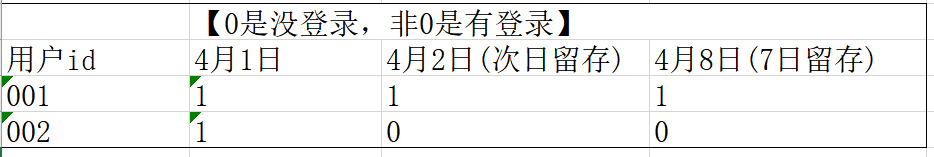

## 行转列

> 行转列的常规做法是：group by + sum( if() )【 或 count( if() ) 】

### 华泰证券1

已知：

| year | month | amount |
| :--- | :---- | :----- |
| 1991 | 1     | 1.1    |
| 1991 | 2     | 1.2    |
| 1991 | 3     | 1.3    |
| 1991 | 4     | 1.4    |
| 1992 | 1     | 2.1    |
| 1992 | 2     | 2.2    |
| 1992 | 3     | 2.3    |
| 1992 | 4     | 2.4    |

查成这样一个结果：

| year | m1  | m2  | m3  | m4  |
| :--- | :-- | :-- | :-- | :-- |
| 1991 | 1.1 | 1.2 | 1.3 | 1.4 |
| 1992 | 2.1 | 2.2 | 2.3 | 2.4 |

SQL：

```sql
use test_sql;
set hive.exec.mode.local.auto=true;
create table table2(year int,month int ,amount double) ;
 insert overwrite table table2 values
           (1991,1,1.1),
           (1991,2,1.2),
           (1991,3,1.3),
           (1991,4,1.4),
           (1992,1,2.1),
           (1992,2,2.2),
           (1992,3,2.3),
           (1992,4,2.4);
select * from table2;


--行转列
--常规做法是，group by+sum(if())
--原始写法
select year,
       sum(a) as m1,
       sum(b) as m2,
       sum(c) as m3,
       sum(d) as m4
from
    (select *,
            if(month=1,amount,0) a,
            if(month=2,amount,0) b,
            if(month=3,amount,0) c,
            if(month=4,amount,0) d
     from table2) t
group by t.year
;
--简化写法
select year,
       sum(if(month=1,amount,0)) m1,
       sum(if(month=2,amount,0)) m2,
       sum(if(month=3,amount,0)) m3,
       sum(if(month=4,amount,0)) m4
from table2
group by year
;
```


### 华泰证券2

> 查询课程编号"2"的成绩比课程编号"1"低的所有同学的学号、姓名

```sql
create table student(sid int, sname string, gender string, class_id int);
insert overwrite table student
values (1, '张三', '女', 1),
       (2, '李四', '女', 1),
       (3, '王五', '男', 2);

select * from student;

create table  course (cid int, cname string, teacher_id int);
insert overwrite table course
values (1, '生物', 1),
       (2, '体育', 1),
       (3, '物理', 2);
select * from course;

create table score (sid int, student_id int, course_id int, number int);
insert overwrite table score
values (1, 1, 1, 58),
       (4, 1, 2, 50),
       (2, 1, 2, 68),
       (3, 2, 2, 89);
select * from score;

with t1 as(
    select student_id,
       sum(if(course_id=2,number,0)) as pe, --体育
       sum(if(course_id=1,number,0)) as bio --生物
from score
group by student_id
having pe<bio)
select sid, sname
from t1
join student
on t1.student_id = sid
;
```


### 腾讯游戏

表table如下：

| DDate      | shengfu |
| :--------- | :------ |
| 2015-05-09 | 胜      |
| 2015-05-09 | 胜      |
| 2015-05-09 | 负      |
| 2015-05-09 | 负      |
| 2015-05-10 | 胜      |
| 2015-05-10 | 负      |
| 2015-05-10 | 负      |

生成下列结果：

| DDate      | 胜 | 负 |
| :--------- | :- | :- |
| 2015-05-09 | 2  | 2  |
| 2015-05-10 | 1  | 2  |

```sql
create table table1(DDate string, shengfu string) ;
insert overwrite table table1 values ('2015-05-09', "胜"),
       ('2015-05-09', "胜"),
       ('2015-05-09', "负"),
       ('2015-05-09', "负"),
       ('2015-05-10', "胜"),
       ('2015-05-10', "负"),
       ('2015-05-10', "负");

select DDate,
       SUM(case when shengfu = '胜' then 1 else 0 end) `胜`,
       SUM(case when shengfu = '负' then 1 else 0 end) `负`
from table1
group by DDate;
```


### 腾讯QQ

假设tableA如表5，tableB如表6

表5：

| qq号（字段名：qq） | 游戏（字段名：game） |
| ------------------ | -------------------- |
| 10000              | a                    |
| 10000              | b                    |
| 10000              | c                    |
| 20000              | c                    |
| 20000              | d                    |

表6：

| qq号（字段名：qq） | 游戏（字段名：game） |
| ------------------ | -------------------- |
| 10000              | a_b_c                |
| 20000              | c_d                  |

> 求：将tableA输出为tableB的格式【行转列】和 将tableB输出为tableA的格式【列转行】

```sql
create table tableA(qq string, game string) 
insert overwrite table tableA values 
       (10000, 'a'),
       (10000, 'b'),
       (10000, 'c'),
       (20000, 'c'),
       (20000, 'd');

create table tableB(qq string, game string) ;
insert overwrite table tableB values 
(10000, 'a_b_c'),
(20000, 'c_d');
   
--将tableA输出为tableB的格式；  
select qq,
       concat_ws('_', collect_list(game)) game
from tableA
group by qq;   
   
--将tableB输出为tableA的格式;  
select qq,
       tmp.game
from tableB lateral view explode(split(game, '_')) tmp as game;
```


## 连续N天登陆

思路分析1：


```sql
--核心代码
-> distinct
-> row_number 
-> date_sub(dt,rn) as dt2
-> group by dt2,name 
-> having count(1)>=N天 
-> distinct name 
-> count(name)
```

思路分析2：


```sql
--核心代码
-> distinct
-> date_add(dt,N-1) as date2
-> lead(dt,N-1) over(partition by userid order by dt) as date3
-> where date2=date3
-> distinct
```


### OPPO

以下为用户登陆游戏的日期，用一条sQL语句查询出连续三天登录的人员姓名：

| name | date       |
| :--- | :--------- |
| 张三 | 2021-01-01 |
| 张三 | 2021-01-02 |
| 张三 | 2021-01-03 |
| 张三 | 2021-01-02 |
| 李四 | 2021-01-01 |
| 李四 | 2021-01-02 |
| 王五 | 2021-01-03 |
| 王五 | 2021-01-02 |
| 王五 | 2021-01-02 |

```sql
create table game(name string,  `date` string);
insert overwrite table game values
('张三','2021-01-01'),
('张三','2021-01-02'),
('张三','2021-01-03'),
('张三','2021-01-02'),

('张三','2021-01-07'),
('张三','2021-01-08'),
('张三','2021-01-09'),

('李四','2021-01-01'),
('李四','2021-01-02'),
('王五','2021-01-03'),
('王五','2021-01-02'),
('王五','2021-01-02');
with t1 as ( select distinct  name,date from game),
     t2 as ( select *,
                    row_number() over (partition by name order by date) rn
         from t1),
     t3 as ( select *,date_sub(date,rn) date2 from t2 )
     select distinct name from t3 group by name,date2 having count(1)>=3;
   
--方案二
select * from game;
with t1 as (
    select distinct name,`date` from game
),
    t2 as (
        select *,
               date_add(`date`,3-1) as date2,
               lead(`date`,3-1) over(partition by name order by `date`) as date3
          from t1
    )
select distinct name from t2 where date2=date3;
--方案二的写法2
with t1 as (
    select distinct name,`date` from game
),
    t2 as (
        select *,
               lead(`date`,3-1) over(partition by name order by `date`) as date3
          from t1
    )
select distinct name from t2 where datediff(date3,`date`)=2 ;
```


### 脉脉

用户每日登陆脉脉会访问app不同的模块，现有两个表

表1记录了每日脉脉活跃用户的uid和不同模块的活跃时长

表2记录了脉脉所有注册用户的一些属性

表1：maimai.dau

| d          | uid | module  | active_duration | 列说明                                                                                                                  |
| :--------- | :-- | :------ | :-------------- | :---------------------------------------------------------------------------------------------------------------------- |
| 2020-01-01 | 1   | jobs    | 324             | d：活跃的日期<br />uid：用户的唯一编码<br />module：用户活跃模块<br />actre.duration：该模块下对应的活跃时长（单位：s） |
| 2020-01-01 | 2   | feeds   | 445             |                                                                                                                         |
| 2020-01-01 | 3   | im      | 345             |                                                                                                                         |
| 2020-01-02 | 2   | network | 765             |                                                                                                                         |
| 2020-01-02 | 3   | jobs    | 342             |                                                                                                                         |
| …         | …  | …      | …              |                                                                                                                         |

>  在过去一个月内，曾连续两天活跃的用户

```sql
-- 表1 dau   记录了每日脉脉活跃用户的uid和不同模块的活跃时长
create table dau(d string, uid int, module string, active_duration int);
insert overwrite table dau
values ('2020-01-01', 1, 'jobs', 324),
       ('2020-01-01', 2, 'feeds', 445),
       ('2020-01-01', 3, 'im', 345),
       ('2020-01-02', 2, 'network', 765),
       ('2020-01-02', 3, 'jobs', 342);
select *from dau;

with t1 as (
    select DISTINCT d, uid from dau),
     t2 as (
         select *,
                date_sub(d, (row_number() over (partition by uid order by d))) dis
         from t1
         where d <= `current_date`()
           and d >= date_sub((`current_date`()), 30)),
t3 as (
    select uid,
           min(d)   `开始日期`,
           max(d)   `结束日期`,
           count(1) `连续登入天数`
    from t2
    group by uid,dis
    having count(*) >= 2 
)
select DISTINCT uid from t3 ;
```


### 广州银行

有一张表C_T（列举了部分数据）表示持卡人消费记录，表结构如下：

| CARD NER  | VARCHAR2 | 卡号     |
| :-------- | :------- | :------- |
| C_MONTH   | NUMBER   | 消费月份 |
| C_DATE    | DATE     | 消费日期 |
| C_TYPEVAR | CHAR2    | 消费类型 |
| C_ATM     | NUMBER   | 消费金额 |

>  求：每个月每张卡连续消费的最大天数（如卡在当月只有一次消费则为1）
>
> 连续消费天数：指一楼时间内连续每天都有消费，同一天有多笔消费算一天消费，不能跨月份统计

```sql
create table c_t
(
    card_nbr string,
    c_month  string,
    c_date   string,
    c_type   string,
    c_atm    decimal
);
insert overwrite table c_t values
                               (1,'2022-01','2022-01-01','网购',100),
                               (1,'2022-01','2022-01-02','网购',200),
                               (1,'2022-01','2022-01-03','网购',300),
                               (1,'2022-01','2022-01-15','网购',100),
                               (1,'2022-01','2022-01-16','网购',200),
                               (2,'2022-01','2022-01-06','网购',500),
                               (2,'2022-01','2022-01-07','网购',800),
                               (1,'2022-02','2022-02-01','网购',100),
                               (1,'2022-02','2022-02-02','网购',200),
                               (1,'2022-02','2022-02-03','网购',300),
                               (2,'2022-02','2022-02-06','网购',500),
                               (2,'2022-02','2022-02-07','网购',800);
with t1 as (select distinct card_nbr,c_month,c_date from c_t),
     t2 as (select *,row_number() over (partition by card_nbr,c_month order by c_date) rn from t1  ),
     t3 as (select *,date_sub(c_date,rn) dt2 from t2  ),
     t4 as (select  dt2,card_nbr,c_month,count(1) as cnt from t3 group by dt2,card_nbr,c_month),
     t5 as ( select *,row_number() over (partition by card_nbr,c_month order by cnt desc) as rn from t4)
select card_nbr,c_month,cnt from t5 where rn=1;
```


## N日留存率

<div align="left"></div>

核心代码：

```sql
-> where 日期 in (首日,1天后,7天后)
-> group by 用户
->count(if(日期=首日,1,null))  as cnt
  count(if(日期=1天后,1,null)) as cnt2
  count(if(日期=7天后,1,null)) as cnt8
->having cnt>0
->count(user_id) as 首日总数
  count(if(cnt2>0,1,null)) as 次日留存数
  count(if(cnt8>0,1,null)) as 7日留存数
->次日留存数/首日总数 as 次日留存率
  7日留存数/首日总数 as 7日留存率
```

先按用户分组，得到每个用户的各相关日期的登录情况：

```sql
select cuid,
       count(if(event_day='2020-04-01',1,null)) as cnt,
       count(if(event_day='2020-04-02',1,null)) as cnt2,
       count(if(event_day='2020-04-08',1,null)) as cnt8
  from tb_cuid_1d
  --提前过滤数据
  where event_day in ('2020-04-01','2020-04-02','2020-04-08')
group by cuid
-- 2020-04-01必须登录，剔除掉2020-04-01没登录的
having cnt>0
```

效果如下：

<div align="left"></div>

再对上面的用户汇总：

```sql
select count(cnt) as uv,
       count(if(cnt2!=0,1,null)) as uv2,
       count(if(cnt8!=0,1,null)) as uv8
```

<div align="left"></div>

最后再用 【后续日期的留存数】除以【首日总数】，就是【留存率】

方案二：

```sql
select count(a.cuid) uv,
       count(b.cuid) uv2,
       count(c.cuid) uv7
from (select distinct event_day, cuid from tb_cuid_1d where event_day='首日') as a
left join (select distinct event_day, cuid from tb_cuid_1d where event_day='次日') as b on a.cuid=b.cuid
left join (select distinct event_day, cuid from tb_cuid_1d where event_day='7日后') as c on a.cuid=c.cuid;
```


### 腾讯视频号游戏直播

表：tableA

| ds(日期)   | device  | user_id | is_active |
| :--------- | :------ | :------ | :-------- |
| 2020-03-01 | ios     | 0001    | 0         |
| 2020--0301 | ios     | 0002    | 1         |
| 2020-03-01 | android | 0003    | 1         |
| 2020-03-02 | ios     | 0001    | 0         |
| 2020-03-02 | ios     | 0002    | 0         |
| 2020-03-02 | android | 0003    | 1         |

> 20200301的ios设备用户活跃的次日留存率是多少？

```sql
use test_sql;
set hive.exec.mode.local.auto=true;
--腾讯视频号游戏直播
drop table if exists tableA;
create table tableA
(ds string comment '(日期)'  ,device string,user_id string,is_active int) ;
insert overwrite table  tableA values
('2020-03-01','ios','0001',0),
('2020-03-01','ios','0002',1),
('2020-03-01','ios','0004',1),
('2020-03-01','android','0003',1),
('2020-03-02','ios','0001',0),
('2020-03-02','ios','0002',0),
('2020-03-02','android','0003',1),
('2020-03-02','ios','0005',1) ,
('2020-03-02','ios','0004',1) ;

--方案1，过程见下面的顺序编号
with t1 as (
    select user_id,
           --3-一个用户如果在'2020-03-01'活跃，则cnt1>0
           count(if(ds = '2020-03-01', 1, null)) cnt1,
           --4-一个用户如果在'2020-03-02'活跃，则cnt2>0
           count(if(ds = '2020-03-02', 1, null)) cnt2
    from tableA
    --1-预先全局过滤
    where device = 'ios'
      and is_active = 1
      and ds in ('2020-03-01', '2020-03-02')
    --2-按用户分组
    group by user_id
    --6-只筛选'2020-03-01'活跃的用户，他在'2020-03-02'是否活跃，看cnt2=0则不活跃，>0则活跃
    having cnt1 > 0
)
select count(cnt1)                               sum1,--'2020-03-01'的活跃数
       count(if(cnt2 > 0, user_id, null))        sum2,----并且在次日依然活跃的用户数
       count(if(cnt2 > 0, user_id, null)) / count(cnt1) rate--次日留存率
from t1;
```


### 百度

有两张表：tb_cuid_1d 和 tb_account_1d

```sql
create table if not exists tb_cuid_1d
(
    cuid         string comment '用户的唯一标识',
    os           string comment '平台',
    soft_version string comment '版本',
    event_day    string comment '日期',
    timestamp    int comment '用户访问时间戳',
    duration     decimal comment '用户访问时长',
    ext          array<string> comment '扩展字段'
);
insert overwrite table tb_cuid_1d values
 (1,'android',1,'2020-04-01',1234567,100,`array`('')),
 (1,'android',1,'2020-04-02',1234567,100,`array`('')),
 (1,'android',1,'2020-04-08',1234567,100,`array`('')),
 (2,'android',1,'2020-04-01',1234567,100,`array`('')),
 (3,'android',1,'2020-04-02',1234567,100,`array`(''));
 
create table if not exists tb_account_1d
(
    cuid      string comment '用户的唯一标识',
    uid       string comment '登入用户账号名',
    event_day string comment '日期'
);
```

> 写出用户表 tb_cuid_1d的 20200401 的次日、次7日留存的具体HQL 
>
> 一条sql统计出以下指标 （4.1号uv，4.1号在4.2号的留存uv，4.1号在4.8号的留存uv）

```sql
--一个理解简单，但是性能不快的做法
select count(a.cuid) uv,
       count(b.cuid) uv2,
       count(c.cuid) uv7
from (select distinct event_day, cuid from tb_cuid_1d where event_day='2020-04-01') as a
left join (select distinct event_day, cuid from tb_cuid_1d where event_day='2020-04-02') as b on a.cuid=b.cuid
left join (select distinct event_day, cuid from tb_cuid_1d where event_day='2020-04-08') as c on a.cuid=c.cuid;
--另一个理解稍微复杂，但是性能快的做法
with t1 as (
    select cuid,
           count(if(event_day='2020-04-01',1,null)) as cnt1,
           count(if(event_day='2020-04-02',1,null)) as cnt2,
           count(if(event_day='2020-04-08',1,null)) as cnt8
     from tb_cuid_1d
     where event_day in ('2020-04-01','2020-04-02','2020-04-08')
     group by cuid
     having cnt1 >0
),
     t2 as (select count(cuid)                  as uv1,
                   count(if(cnt2 > 0, 1, null)) as uv2,
                   count(if(cnt8 > 0, 1, null)) as uv7
            from t1
            )
select *,
       uv2 / uv1 as `次日留存率`,
       uv7 / uv1 as `7日留存率`
from t2;
```


## 分组内top前几

> 公式：row_number() over(partition by 组名 order by yyy)  as rn，再筛选rn<=N名

### 跨越物流

员工表结构：

<div align="left"></div>

员工表数据：

<div align="left"></div>

> 求出每个部门工资最高的前三名员工，并计算这些员工的工资占所属部门总工资的百分比

结果：


```sql
create table emp(empno string ,ename string,hiredate string,sal int ,deptno string);
insert overwrite table emp values
('7521', 'WARD', '1981-2-22', 1250, 30),
('7566', 'JONES', '1981-4-2', 2975, 20),
('7876', 'ADAMS', '1987-7-13', 1100, 20),
('7369', 'SMITH', '1980-12-17', 800, 20),
('7934', 'MILLER', '1982-1-23', 1300, 10),
('7844', 'TURNER', '1981-9-8', 1500, 30),
('7782', 'CLARK', '1981-6-9', 2450, 10),
('7839', 'KING', '1981-11-17', 5000, 10),
('7902', 'FORD', '1981-12-3', 3000, 20),
('7499', 'ALLEN', '1981-2-20', 1600, 30),
('7654', 'MARTIN', '1981-9-28', 1250, 30),
('7900', 'JAMES', '1981-12-3', 950, 30),
('7788', 'SCOTT', '1987-7-13', 3000, 20),
('7698', 'BLAKE', '1981-5-1', 2850, 30);

select * from emp;

--求出每个部门工资最高的前三名员工，并计算这些员工的工资占所属部门总工资的百分比。
select a.empno,
       a.sal,
       a.deptno,
       a.rn,
       a.sum_sal,
       round(a.sal/a.sum_sal,2) as rate
from
(select *,
--每个部门工资排名
         row_number() over (partition by deptno order by sal desc) as rn, 
--每个部门的总工资
         sum(sal) over(partition by deptno ) as sum_sal 
from emp) a
where rn<=3;
```


### 小米电商

订单表：t_order	字段：user_id, order_id, ctime(10位时间戳)，city id，sale_num，sku_id(商品)

> 问题：20201201至今每日订单量 top10 的城市及其订单量（订单量对order id去重）

```sql
create table t_order (user_id string, 
                      order_id string, 
                      ctime string, 
                      city_id string, 
                      sale_num int , 
                      sku_id string) ;
with t1 as (select to_date(ctime) cdate, city_id, count(distinct order_id) cnt
            from t_order
            where to_date(ctime) >= '2020-12-01'
              and to_date(ctime) <= `current_date`()
            group by to_date(ctime), city_id),
     t2 as (select *, row_number() over (partition by cdate order by cnt desc) rn from t1)
select cdate, city_id, cnt
from t2
where rn <= 10;
```


## 窗口函数

* 窗口函数的最大特点是有 over() 关键字
* 聚合类的窗口函数

  * sum() over()
  * count/avg/max/min
* 排序类的窗口函数

  * row_number，rank，dense_rank
* 偏移类的，跨行的

  * lag / lead
* first_value/last_value
* ntile


### 交通银行

Emp表：

| NAME | MONTH | AMT |
| :--- | :---- | :-- |
| 张三 | 01    | 100 |
| 李四 | 02    | 120 |
| 王五 | 03    | 150 |
| 赵六 | 04    | 500 |
| 张三 | 05    | 400 |
| 李四 | 06    | 350 |
| 王五 | 07    | 180 |
| 赵六 | 08    | 400 |

> 写出可以得到以下的结果SQL

| NAME | 总金额 | 排名 | 占比   |
| :--- | :----- | :--- | :----- |
| 赵六 | 900    | 1    | 40.91% |
| 张三 | 500    | 2    | 22.73% |
| 李四 | 470    | 3    | 21.36% |
| 王五 | 330    | 4    | 15.00% |

```sql
create table emp(name string , month string, amt int);
insert overwrite table emp values ('张三', '01', 100),
       ('李四', '02', 120),
       ('王五', '03', 150),
       ('赵六', '04', 500),
       ('张三', '05', 400),
       ('李四', '06', 350),
       ('王五', '07', 180),
       ('赵六', '08', 400);
--rank 1224
--dense_rank 1223
with t1 as (select name,
                   sum(amt) as sum_amt
            from emp
            group by name),
     t2 as (
         select name,
                sum_amt,
                row_number() over (order by sum_amt desc) rn,
                sum_amt/sum(sum_amt) over () as rate
         from t1
     )
select name, sum_amt, rn, concat(round(rate*100,2),'%') rate from t2
```

### 跨越物流

题目描述:

> a	在第一题员工表的基础上，统计每年入职总数以及截至本年累计入职总人数
>
> b	截至本年累计入职总人数=本年总入职人数 + 本年之前所有年的总入职人数之和

结果：

<div align="left"></div>

```sql
select *,
       sum(cnt) over (order by year1) cnt2
from
(select year(hiredate) as year1,
       count(1) as cnt
from emp
group by year(hiredate)) a;
```


## 带条件的聚合统计

> 一般的做法是group by xx,yy  再多次的sum( if(......) )
>
> 好处是避免多次加载表，一次性得到多个指标，可以只加载一次表就得到多个指标。


### 腾讯数据提取

用户行为表：t_user_video_action_d分区：ds（格式 yyyyMMdd）

主键：user_id、video_id

含义：一个 user 对一个视频的所有行为聚合，每天增量字段

| 字段名     | 字段含义 | 类型   |
| :--------- | :------- | :----- |
| user_id    | 用户 id  | string |
| video_id   | 视频 id  | string |
| expose_cnt | 曝光次数 | int    |
| like_cnt   | 点赞次数 | int    |

视频表：t_video_d

分区：ds（格式 yyyyMMdd）主键：video_id

含义：当天全量视频数据字段

| 字段名            | 字段含义           | 类型   | 枚举             |
| :---------------- | :----------------- | :----- | :--------------- |
| video_id          | 视频 id            | string |                  |
| video_type        | 视频类型           | string | 娱乐、新闻、搞笑 |
| video_user_id     | 视频创建者 user_id | string |                  |
| video_create_time | 视频创建时间       | bigint |                  |

作者表：t_video_user_d

分区：ds（格式 yyyyMMdd）主键：video_user_id

含义：当天全量视频创建者数据

| 字段名          | 字段含义           | 类型   | 枚举             |
| :-------------- | :----------------- | :----- | :--------------- |
| video_user_id   | 视频创建者 user_id | string |                  |
| video_user_name | 名称               | string |                  |
| video_user_type | 视频创建者类型     | string | 娱乐、新闻、搞笑 |

> 需求方需要视频号搞笑类型视频的曝光点赞时长等数据，请提供一张 ads 表。搞笑类型视频定义：视频类型为搞笑或者视频创建者类型为搞笑
>
> 需要产出字段：视频 id，视频创建者 user_id，视频创建者名称、当天曝光次数、当天点赞次数、近 30 天曝光次数、近 30 天点赞次数

```sql
 create table if not exists t_user_video_action_d
(
    user_id    string comment "用户id",
    video_id   string comment "视频id",
    expose_cnt int comment "曝光次数",
    like_cnt   int comment "点赞次数"
) partitioned by (ds string);

drop table t_video_d;
create table if not exists t_video_d
(
    video_id          string comment '视频id',
    video_type        string comment '视频类型',
    video_user_id     string comment '视频创建者user_id',
    video_create_time bigint comment '视频创建时间'
) partitioned by (ds string);

create table if not exists t_video_user_d
(
    video_user_id   string comment '视频创建者user_id',
    video_user_name string comment '名称',
    video_user_type string comment '视频创建者类型'
) partitioned by (ds string);


--假设当天是2022-07-31
select t1.*,
       t2.video_user_id,
       t2.video_user_name
from (select video_id,
             sum(case when ds = '2022-07-30' then expose_cnt else 0 end),--当天曝光次数、
             sum(case when ds = '2022-07-30' then like_cnt else 0 end),-- 当天点赞次数、
             sum(expose_cnt) as sum_expose,-- 近 30 天曝光次数、
             sum(like_cnt)-- 近 30 天点赞次数
      from t_user_video_action_d
      where ds between '2022-07-01' and '2022-07-30'
      group by video_id) as t1
join (select d.video_id, d.video_user_id, u.video_user_name
   from t_video_d d
   join t_video_user_d u on d.video_user_id = u.video_user_id
   where (d.video_type like '%搞笑%' or u.video_user_type like '%搞笑%')
     and d.ds = '2022-07-30'
     and u.ds = '2022-07-30') as t2 on t1.video_id = t2.video_id;
```


### 小米电商

表sale：

```sql
Create table sale_order(
    Order_id bigint comment '订单ID',
    User_id bigint comment '用户ID',
    Order_status int,
    Create_time string,
    Last_update_time string,
    Product_id bigint,
    Product_num bigint 
);
```

用户注册表：

```sql
Create table user_info(
    user_id bigint comment'用户ID，唯一主键',
    sex string.
    age int
);
```

> 用一条SQL生成完整的用户画像表
>
> 包含如下字段：user_id,  sex,  age,  d7order_num,   d14_order_num，后面两个字段分别为近7天订单数量，近14天订单数量

```sql
create table sale_order(
    order_id bigint comment '订单ID',
    user_id bigint comment '用户ID',
    order_status int ,
    create_time string,
    last_update_time string,
    product_id bigint,
    product_num bigint
);
create table user_info(
    user_id bigint comment '用户ID,唯一主键',
    sex string,
    age int
);

select u.user_id,
       s.d7order_num,
       s.d14order_num
from user_info u
left join (select user_id,
                  count(if(create_time >= '7天前'  and create_time <= '今天', order_id,null)) as d7order_num,
                  count(if(create_time >= '14天前' and create_time <= '今天', order_id,null)) as d14order_num
           from sale_order
           where create_time >= '14天前'
           group by user_id) s on u.user_id = s.user_id;
```
